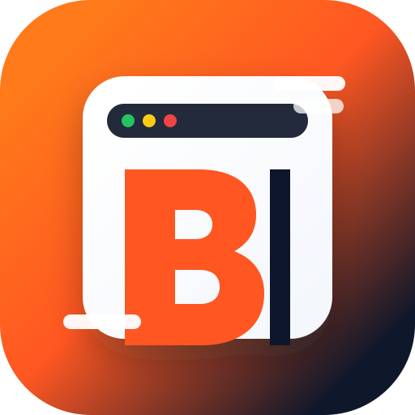

<p align="center">
  
</p>

# BulkHogan Desktop

<p align="center">
  <a href="https://github.com/AnARCHIS12/Bulk-hogan/actions/workflows/build.yml"></a>
  <a href="https://github.com/AnARCHIS12/Bulk-hogan/releases/latest"></a>
  <a href="https://github.com/AnARCHIS12/Bulk-hogan/releases"></a>
  
  
</p>

BulkHogan Desktop est une application Electron pour traiter en masse des questions avec l'API Mistral AI. Elle charge l'interface dans une fenêtre native, stocke les réponses localement et évite les blocages CORS des ouvertures `file://`.

## Télécharger

Page de téléchargement :

https://anarchis12.github.io/Bulk-hogan/

Les installateurs sont aussi publiés dans la dernière release GitHub :

https://github.com/AnARCHIS12/Bulk-hogan/releases/latest

Formats fournis :

| Système | Fichier |
|---|---|
| Linux portable | `BulkHogan-1.0.0-linux-x86_64.AppImage` |
| Debian / Ubuntu | `BulkHogan-1.0.0-linux-amd64.deb` |
| Fedora / RHEL | `BulkHogan-1.0.0-linux-x86_64.rpm` |
| Windows | `BulkHogan-1.0.0-win-x64.exe` |

## Fonctionnalités

- Traitement par lots de questions, une ligne par question.
- Rotation entre plusieurs modèles Mistral.
- Pré-prompt système optionnel.
- Historique local via IndexedDB.
- Détection des doublons déjà traités.
- Gestion des pauses en cas de rate limit.
- Import de fichiers `.txt` ou `.csv`.
- Application desktop Linux et Windows.

## Utilisation

1. Lancez BulkHogan Desktop.
2. Entrez votre clé API Mistral.
3. Sélectionnez un ou plusieurs modèles.
4. Ajoutez vos questions, une par ligne, ou importez un fichier.
5. Lancez le traitement.
6. Consultez l'historique local des réponses.

## Développement

Prérequis :

- Node.js 22+
- npm

Installation :

```bash
npm install
```

Lancer en mode desktop :

```bash
npm start
```

## Builds

Build Linux complet :

```bash
npm run dist:linux
```

Build Windows :

```bash
npm run dist:win
```

Build Linux + Windows :

```bash
npm run dist:all
```

Build de vérification sans installateur :

```bash
npm run pack
```

Les artefacts sont générés dans `dist/`.

## GitHub Actions

Le workflow `.github/workflows/build.yml` génère automatiquement :

- `AppImage`
- `deb`
- `rpm`
- `exe`

Les artefacts sont disponibles dans l'onglet Actions et peuvent être attachés aux releases GitHub.

## Structure

| Fichier | Rôle |
|---|---|
| `index.html` | Interface BulkHogan |
| `main.js` | Processus principal Electron |
| `package.json` | Scripts npm et configuration Electron Builder |
| `build/icon.svg` | Logo source |
| `build/icon.png` | Icône Linux |
| `build/icon.ico` | Icône Windows |
| `.github/workflows/build.yml` | Build CI Linux et Windows |

## Licence

MIT
